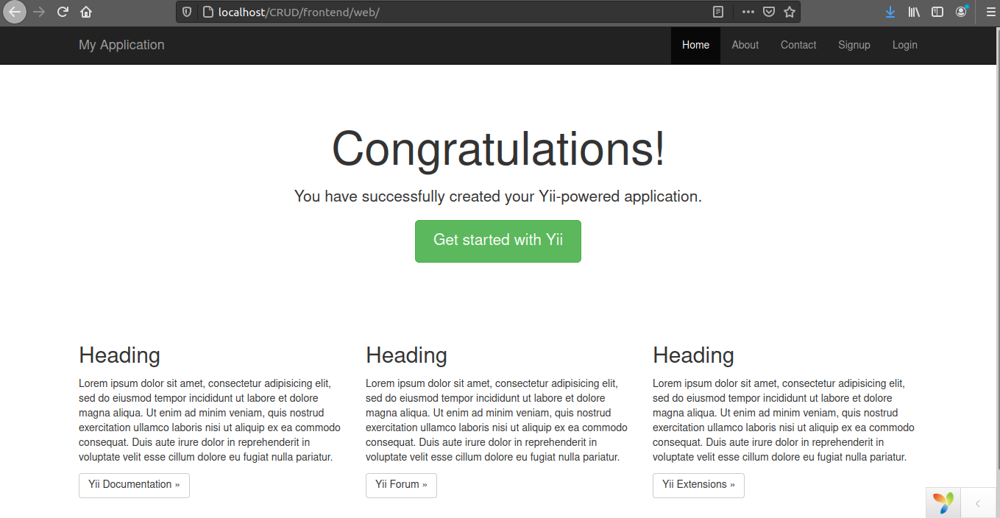

### Introduction
Programmers who have ever worked with the database are likely to have also worked with CRUD Operations. These operations are very important when a developer wants to learn any web framework. In this article, we will learn how to operates CRUD using [YII 2 framework]().

### What is CRUD?
CRUD is an acronym that stands for Create, Read, Update, Delete. Each letter in the acronym can refer to all functions executed in relational database applications.

Let us look at the function of each letter in details:

1. CREATE - Performs the INSERT operation to a new record.

2. READ - Reads and display the record based on the Primary key.

3. UPDATE - Execute an UPDATE statement in the table depending on the Primary key for a record within the WHERE condition.

4. Delete - Deletes a row in the WHERE condition.

### What Is GII?
[GII]() is a YII module that generates code for CRUD, forms, models, and controllers. In YII 2 Framework GII is accessible by the localhost by default and the module is accessed in the browser.

Prerequisites

I will assume that you have:

1. Xampp installed in your machine. If not follow [these](https://www.section.io/engineering-education/maria-data-base/) steps to install. This will come along with PhpMyAdmin which we will use to manage our database record.
After installing Xampp, a folder `/opt/lampp` will be created in Linux OS.

2. YII 2 installed. If not refer [here](https://www.section.io/engineering-education/php-yii2-framework/) on how to install. Install the advanced application template.

In this article we are going to:

1. Create a YII project named CRUD. 
2. Create a simple database record using terminal 
3. Generate CRUD using GII
4. Store data in database using GII

Let's get started.

### Step 1 -- Create a YII CRUD project

1. Navigate to the folder where the YII archive file was downloaded. In my case, it was downloaded in Downloads.  
2. Move this archive to `/opt/lampp/htdocs` . To move it, open the Downloads folder with terminal and type:

```bash
$ sudo mv yii-advanced-app-2.0.42.tgz /opt/lampp/htdocs
```

3. Now, open `/optlampp/htdocs` using teminal and type this command:
```
$ sudo tar -xvzf yii-advanced-app-2.0.42.tgz
```
This command will unzip the Yii file and generate a new  folder `advanced`

4. Navigate to the advanced folder by typing:

```bash
$ cd advanced
```
Run the command below:

```bash
$ sudo php init
```
This command will initialize your project in advanced. Choose option 0.

5. To rename this project to CRUD project, open `/opt/lampp/htdocs` and enter:
```bash
$ sudo mv advanced CRUD
```

You have created a YII project named CRUD successfully. Congrats!

NB. Please make sure you start your servers before running your project. Start Servers by entering the following command:
```
$ sudo /opt/lampp/lampp start
```
You can also refer to `Step 1` [here](https://www.section.io/engineering-education/maria-data-base/) on how to start the server.

To verify this, open your browser and type http://localhost/CRUD/frontend/web. This is what you should see:



### Connecting CRUD project with the database

Open the `CRUD` project with your favorite type editor and navigate to, `common > config > mainlocal.php`. Change the code to look similar to this:
```php
<?php
return [
    'components' => [
        'db' => [
            'class' => 'yii\db\Connection',
            'dsn' => 'mysql:host=localhost;dbname=CRUD',
            'username' => 'root',
            'password' => '',
            'charset' => 'utf8',
        ],
        'mailer' => [
            'class' => 'yii\swiftmailer\Mailer',
            'viewPath' => '@common/mail',
            // send all mails to a file by default. You have to set
            // 'useFileTransport' to false and configure a transport
            // for the mailer to send real emails.
            'useFileTransport' => true,
        ],
    ],
];

```
In the above code snippets, we have changed the `dbname` name from ``yiiadvanced`` to CRUD. By doing this we have connected our Project with the database.

Let us now create a table in our database using terminal. Refer on  `Step - 2` [here](https://www.section.io/engineering-education/maria-data-base/) and create a database `CRUD`  and table `contacts`


### Conclusion
